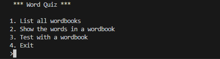
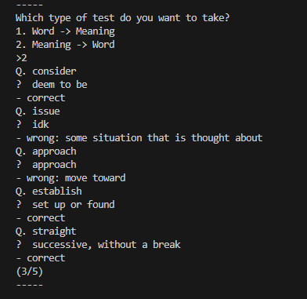

<a name="top"></a>
<div align="center">
  
# WordQuiz
   
Welcome to **WordQuiz**. It is a word quiz program developed using **C**. You can improve your vocabulary by taking quizzes related to various words.
This project was developed for learning purposes and it was made to make studying English more interesting.
   
If you want, you can add a wordbook to `/wordbooks/` and you can modify the existing wordbook.   
Hope you enjoy 👍


</div>

## How to Install and Run the WordQuiz

1. **Clone the repository:**
   ```bash
   git clone https://github.com/wien0128/wordquiz.git
   cd wordquiz
   ```

2. **Compile the source code:**
   ```bash
   gcc -o wordquiz wordquiz.c
   ```

3. **Run the program:**
   ```bash
   ./wordquiz
   ```

## How to Play the WordQuiz

1. **Program Run:**
   ```bash
   ./wordquiz
   ```

2. **Main Menu:**
   Choose a number corresponding to 1 to 4.
   ```
   *** Word Quiz ***

   1. List all wordbooks
   2. Show the words in a wordbook
   3. Test with a wordbook
   4. Exit
   > (1 ~ 4) 
   ```

4. **List wordbooks:**
   You can also add a Wordbook directly to the "workbooks" folder.
   ```
   *** Word Quiz ***

   1. List all wordbooks
   2. Show the words in a wordbook
   3. Test with a wordbook
   4. Exit
   > 1
   
   ---
   voca1
   voca2
   ---
   ```

5. **Test with a wordbook:**
   ```
   Type in the name of the Wordbook?
   > (voca1/voca2 or other wordbook)

   -----
   Which type of test do you want to take?
   1. Word -> Meaning
   2. Meaning -> Word
   > (1 or 2)
   Q. deem to be
   ? (Answer)
   ```

6. **Program exit:**
   ```
   *** Word Quiz ***

   1. List all wordbooks
   2. Show the words in a wordbook
   3. Test with a wordbook
   4. Exit
   > 4
   ```
## Main Menu Features
A number between 1 and 4 selects all menu selections.   
For a workbook, you can choose the name of the wordbook.   
   
- `1. List all wordbooks`: Show all the wordbooks in `/wordbooks/`.   
- `2. Show the words in a wordbook`: Pick a wordbook and look at the words and meanings.   
- `3. Test with a wordbook`: Pick a wordbook and take a test. When all the questions are finished, the score is output.   
- `4. Exit`: End the program.   

### Screenshots
- **Main Menu:**   
  
  
- **Quiz:**   
  
  
- **Check the score:**   
  

## Credits

- **Team:** Group#202
- **Contributors:** Wien0128, JeonYeongwoo, BumGyo, OPCIO0568
- **Organization:** Department of Software, Chungbuk National University

## License

[to the top](#top)

This project is licensed under the MIT License - see the [LICENSE](LICENSE.md) file for details.
